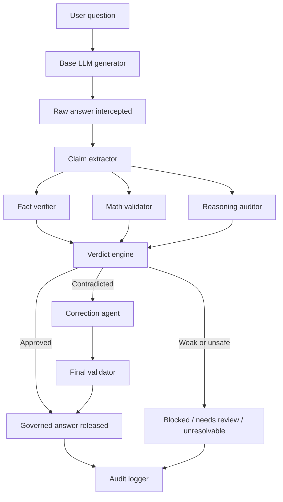
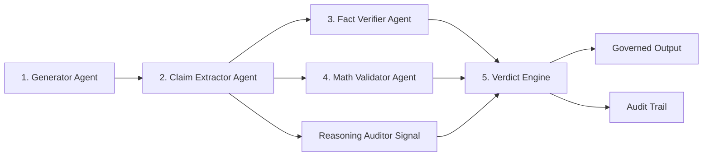
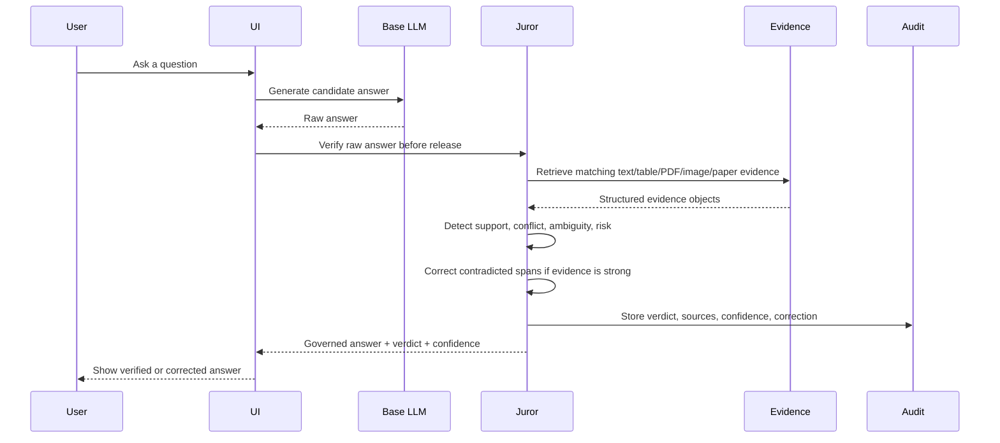
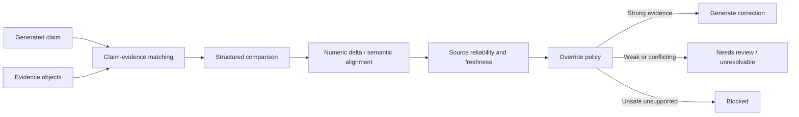
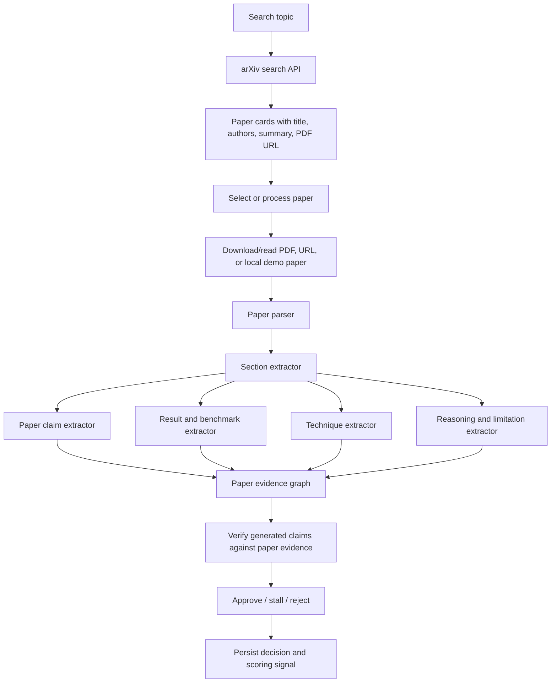

# CARE-Graph-M: AI Hallucination Juror

CARE-Graph-M is a working prototype of an **AI Hallucination Juror**: a governed AI system that intercepts an LLM answer before the user trusts it, decomposes the answer into checkable claims, compares those claims against multiple evidence sources, and returns a verdict with confidence, corrections, and an audit trail.

The project is designed around a simple principle:

> The raw LLM answer is never the final answer. It is evidence to be judged.

Instead of blindly trusting a model response, CARE-Graph-M behaves like an AI review board. A generator creates a candidate answer, then independent juror components check facts, math, source quality, contradiction severity, paper evidence, and reasoning consistency. The UI then shows the raw answer, governed answer, confidence rings, evidence comparison, research-paper context, and human decision controls.

## What We Built

The current prototype includes four connected systems:

1. **Governed LLM Answering**
   - Calls a base LLM provider, currently Gemini from `.env`.
   - Optionally applies a fault-injection prompt modifier to create confidently wrong demo outputs.
   - Intercepts the raw answer before release.
   - Verifies it against local evidence, uploaded sources, and external verifier fallback.
   - Returns only the governed answer to the user.

2. **Contradiction Resolution Engine**
   - Extracts structured claims from generated text.
   - Normalizes evidence from text, tables, CSV, image text/OCR, PDFs, and paper evidence.
   - Classifies claim-evidence relations as supported, contradicted, unsupported, ambiguous, needs review, blocked, or unresolvable.
   - Generates corrections only from validated evidence.
   - Stores audit records and analysis rounds in SQLite.

3. **Research Paper Feeder**
   - Searches arXiv for papers by topic.
   - Converts arXiv `/abs/...` links into PDF links.
   - Downloads/parses selected papers when available.
   - Extracts sections, techniques, numerical results, limitations, conclusions, and paper evidence nodes.
   - Compares generated claims against what the paper actually supports.
   - Includes a synthetic demo-paper showcase mode for stable hackathon demos when live arXiv/PDF fetches are flaky.

4. **Interactive Demo Dashboard**
   - Static frontend served by the FastAPI app under `/ui/`.
   - Shows circular confidence bars for verdicts, source relevance, and paper-agent progress.
   - Lets the user search papers, select/process a paper, inspect progress, and approve/stall/reject evidence.
   - After a human decision, stores the paper result in approved, stalled, or rejected evidence files.

## End-to-End Flow



This is the core "jury" loop. The base model can be wrong, incomplete, or intentionally fault-injected for demos. The juror decides what is safe to release.

## Five-Agent Jury Pipeline

CARE-Graph-M is organized around a five-agent jury pipeline. Each agent owns one part of the verification process, and the final answer is released only after the verdict engine has combined their signals.



### 1. Generator Agent

The Generator Agent calls the base LLM and produces the first candidate answer. This answer is intentionally treated as untrusted. It may be correct, incomplete, overconfident, or wrong. In demo mode, the system can apply a fault-injection prompt modifier so the generator produces simple confident mistakes that the juror can catch and correct.

### 2. Claim Extractor Agent

The Claim Extractor Agent breaks the raw answer into structured, checkable claims. It converts free text into fields such as claim type, entity, metric, value, unit, time period, and safety sensitivity.

Example structured claim:

```json
{
  "text": "Revenue was 10 in Q3.",
  "claim_type": "numeric_fact",
  "metric": "revenue",
  "value": 10,
  "time_period": "Q3"
}
```

### 3. Fact Verifier Agent

The Fact Verifier Agent compares extracted claims against available evidence. Evidence can come from local text, CSV tables, PDFs, image-derived text, arXiv paper metadata, parsed research-paper evidence, synthetic demo papers, and external verifier signals such as Groq.

It decides whether each claim is supported, contradicted, partially supported, unsupported, ambiguous, or unresolvable.

### 4. Math Validator Agent

The Math Validator Agent checks numerical and calculation-style claims using deterministic validation wherever possible. This is important for engineering, finance, benchmarks, formulas, and other technical answers where language similarity alone is not enough.

### 5. Verdict Engine

The Verdict Engine aggregates the juror signals and returns one final outcome:

- `APPROVED`
- `FLAGGED`
- `NEEDS_REVIEW`
- `BLOCKED`
- `UNRESOLVABLE`

If a claim is contradicted by strong evidence, the verdict engine can trigger the correction agent. If the evidence is weak, stale, or internally inconsistent, the system abstains instead of inventing a correction.

Supporting modules extend the five-agent core:

- **Reasoning Auditor** checks whether conclusions follow from evidence.
- **Correction Agent** rewrites only contradicted spans using validated evidence.
- **Final Validator** re-runs corrected text through the same verification path.
- **Audit Logger** stores verdicts, sources, confidence scores, prompt metadata, and human decisions.

## Governed Answer Pipeline



Example:

- Raw LLM answer: `Revenue was 10 in Q3.`
- Trusted table: `Q3 revenue = 8`
- Verdict: `FLAGGED`
- Governed answer: `Revenue was 8 in Q3.`
- Audit trail: claim, evidence, source type, confidence vector, correction status, final verdict.

## Contradiction Resolution

The contradiction engine does not blindly trust either the LLM or a source labeled official. It uses a confidence vector and override policy.



The verifier checks:

- same entity
- same metric
- same time period
- same unit
- source reliability
- freshness
- extraction quality
- corroboration
- math validity
- semantic alignment
- conflict severity

For numeric claims it calculates:

```text
numeric_delta = abs(claim_value - evidence_value) / max(abs(evidence_value), 1e-9)
```

Then it classifies conflicts as noise, soft conflict, or hard conflict.

## Research Paper Feeder Flow

The Research Paper Agent turns papers into structured evidence instead of merely summarizing them.



The paper feeder extracts:

- research problem
- proposed method
- techniques used
- datasets and benchmarks
- numerical results
- baselines
- metrics
- limitations
- assumptions
- conclusions
- weak/speculative claims
- reasoning behind conclusions

It can flag overgeneralization. For example:

- Generated claim: `The model works better for all languages.`
- Paper evidence: `The model improves F1 score on three English low-resource datasets.`
- Verdict: `FLAGGED`
- Corrected claim: `The model improves F1 score on three English low-resource datasets.`

## Demo Showcase Mode

The UI supports a synthetic demo mode for reliable presentations. If live arXiv search or PDF fetch is unavailable, the system shows curated synthetic demo papers for topics like:

- hallucination detection
- retrieval-augmented classification
- medical summarization
- structural engineering verification
- quantum error correction
- multimodal hallucination
- multi-agent AI verification

These demo papers are clearly labeled as **Synthetic demo paper**. They are intentionally high-confidence and visually appealing so the full pipeline can be demonstrated offline:


After a decision:

- **Approve** stores accepted evidence in `approved_paper_evidence.json`
- **Stall** archives evidence in `stalled_paper_archive.json`
- **Reject** stores an invalid/negative signal in `rejected_paper_signals.json`

The decision is terminal in the UI: once a paper result is approved, stalled, or rejected, the decision buttons are disabled and the progress ring completes to `100%`.

## Core Components

- `api/` - FastAPI app and HTTP routes
- `ui/` - dashboard for governed answers, paper search, paper-agent progress, and decisions
- `care/llm/` - base LLM client for Gemini, Groq, OpenAI, Anthropic, and mock generation
- `care/jury/` - claim extraction, evidence parsing, contradiction detection, correction, scoring, audit logging
- `care/research/` - arXiv search, paper parser, paper evidence extraction, paper verifier, paper agent
- `care/ingestion/` - text, table, PDF, and image-text ingestion helpers
- `care/service/` - governed answer orchestration and graph-backed pipeline
- `care/graph/` - graph models, claim storage, Neo4j support
- `care/confidence/` - source and confidence scoring utilities
- `care/retrieval/` - hybrid retrieval logic
- `scripts/` - demos and API test utilities

## Prototype Status

Implemented:

- FastAPI backend
- browser UI at `/ui/`
- governed LLM answer endpoint
- Gemini base generation from `.env`
- Groq verifier fallback for uncovered questions
- fault-injection demo mode
- claim extraction for factual, numeric, generic, and verb-style claims
- text, table, CSV, PDF, and image-text evidence ingestion
- contradiction detection and correction
- confidence vectors and source reliability scoring
- immutable audit trail in SQLite
- analysis-round storage and PDF report download
- arXiv paper search
- research paper parser and evidence extractor
- synthetic fallback papers for demo stability
- paper-agent approve/stall/reject storage loop
- LangGraph jury workflow tests

Still prototype-grade:

- paper PDF extraction is lightweight compared with production document AI
- confidence numbers are demo-calibrated, not statistically calibrated
- synthetic demo papers are intentionally artificial and labeled as such
- production deployments should replace synthetic fallback scoring with measured evaluation
- Neo4j/vector backends are available, but the UI demo can run without them

## Requirements

- Python 3.11+
- Neo4j
- optional transformer dependencies for real model-backed scoring

## Setup

```bash
python -m venv .venv
.venv/bin/pip install -e .
```

If you want the real model-backed scoring path, set:

```bash
export CARE_MODEL_BACKEND=transformers
export CARE_GRAPH_BACKEND=neo4j
export CARE_NEO4J_URI=bolt://127.0.0.1:7687
export CARE_NEO4J_USER=neo4j
export CARE_NEO4J_PASSWORD=password
```

Optional calibration artifact:

```bash
export CARE_CONFIDENCE_CALIBRATOR_PATH=/absolute/path/to/calibrator.json
```

## Run the API

```bash
.venv/bin/python -m uvicorn api.app:app --host 127.0.0.1 --port 8000
```

## Example Usage

### Ingest text

```bash
curl -X POST http://127.0.0.1:8000/ingest/text \
  -H "Content-Type: application/json" \
  -d '{
    "source_id": "memo-1",
    "text": "Berlin is the capital of Germany.",
    "source_metadata": {
      "source_type": "news_article",
      "publication_date": "2026-04-01T00:00:00+00:00",
      "domain_type": "political"
    }
  }'
```

### Ingest table

```bash
curl -X POST http://127.0.0.1:8000/ingest/table \
  -H "Content-Type: application/json" \
  -d '{
    "source_id": "cities-table",
    "path": "/absolute/path/to/sample_cities.csv",
    "source_metadata": {
      "source_type": "official_documentation",
      "domain_type": "historical"
    }
  }'
```

### Query

```bash
curl -X POST http://127.0.0.1:8000/query \
  -H "Content-Type: application/json" \
  -d '{
    "query": "What is the capital of Germany?",
    "budget": 512
  }'
```

### Generate Through the Juror

`/verify/generate` calls the base LLM provider first, intercepts that raw answer, verifies it against evidence, and returns only the governed answer.

```bash
curl -X POST http://127.0.0.1:8000/verify/generate \
  -H "Content-Type: application/json" \
  -d '{
    "question": "What was revenue in Q3?",
    "use_graph_context": false,
    "evidence_sources": [
      {
        "source_name": "Q3 Official Revenue Table",
        "source_type": "official_table",
        "table": [{"quarter": "Q3", "revenue": "8"}]
      }
    ]
  }'
```

## Response Shape

`/query` returns:
- `answer`
- `evidence.primary`
- `evidence.supporting`
- `evidence.contradictions`
- `summary`
- confidence fields including raw, calibrated and propagated confidence

## Development

Run tests:

```bash
pytest tests -q
```

## Limitations

This is a prototype, not a finished research system.

Known gaps:
- no fitted isotonic calibrator yet
- no image modality yet
- no production vector DB yet
- no full benchmark and evaluation suite yet

## Roadmap

Next major work:
1. fitted calibration workflow
2. extraction-confidence capture at ingest time
3. self-consistency scoring
4. persisted graph support edges
5. image modality
6. benchmark and evaluation package
